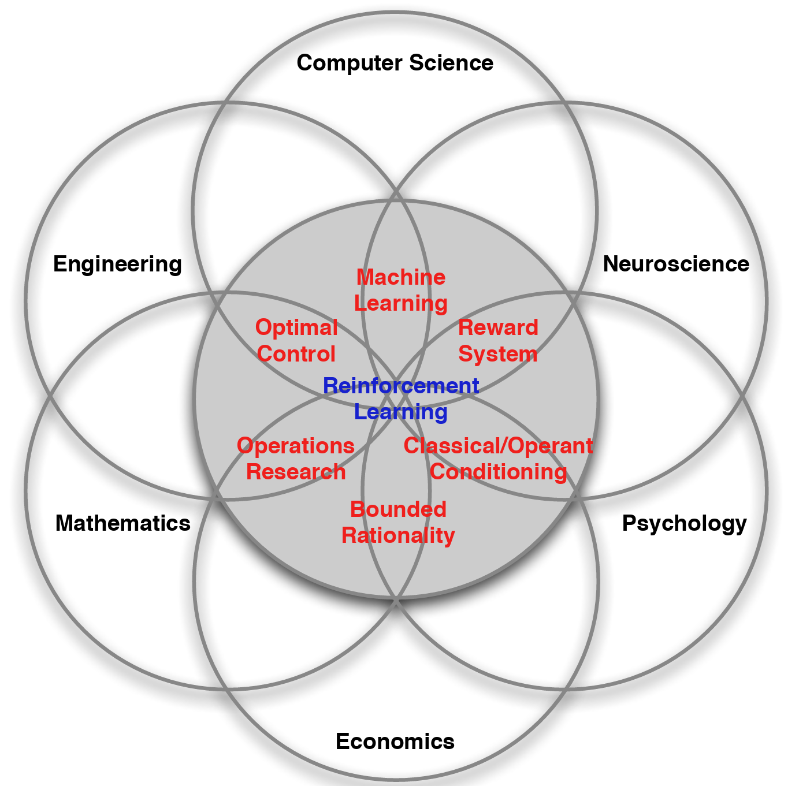
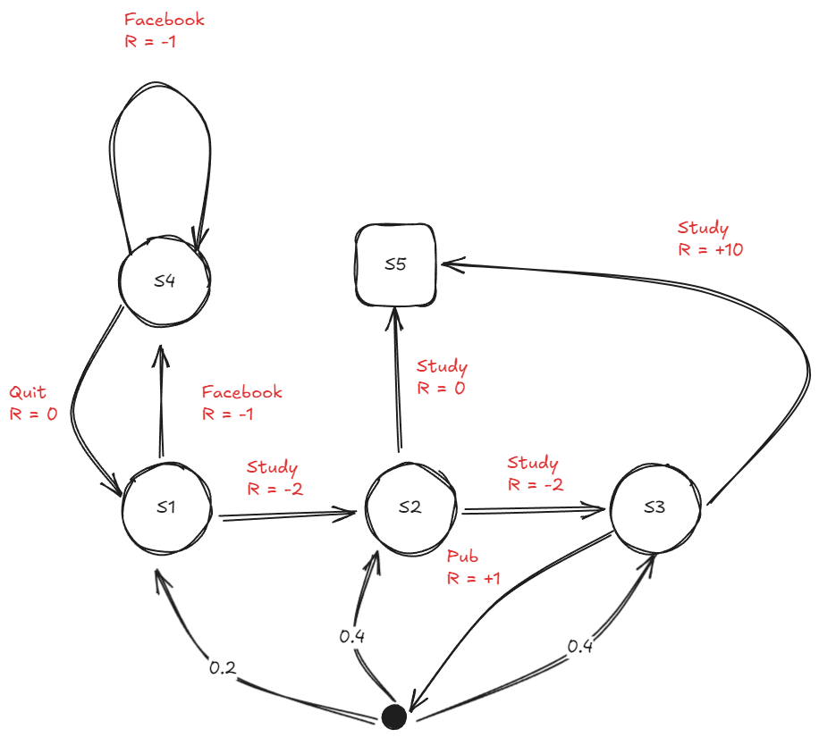

Markov Decision Process (MDP) almost defines the standard format of the reinforcement learning. With the symbolic representation, almost any problem can be transfered to the MDP. Learning the reinforcement, MDP is the best start. 

# Definition of Reinforcement Learning

The direct neural network training process, always feeds the data to the model directly. The target is to improve its perceptibility (like CNN) instead of the decision-making capability. The Reinforcement Learning (RL) showed up to make the agent learn from the feedback from the enviroment. With the reward from the enviroment, the dicision made by the agent can gradually meet the human's expectation. In machine learning area, with a trainable agent, we hope it can find the optimal strategies to the certain decision problem. 

Formulaically, all the reinforcement learning can be seen as a MDP. The solution to such scenario, is also the solution of the RL. 

# Markov Process
In probability theory and statistics, a Markov chain or Markov process is a stochastic process describing a sequence of possible events in which the probability of each event depends only on the state attained in the previous event. Informally, this may be thought of as, "What happens next depends only on the state of affairs now." A countably infinite sequence, in which the chain moves state at discrete time steps, gives a discrete-time Markov chain (DTMC). A continuous-time process is called a continuous-time Markov chain (CTMC). Markov processes are named in honor of the Russian mathematician Andrey Markov[^1].

A Markov process is a stochastic process that satisfies the Markov property. It's simply "memorylessness". The predictions can be made regarding future outcomes based solely on its present state and—most importantly—such predictions are just as good as the ones that could be made knowing the process's full history. Formally: 
$$
P(s_{t+1} | s_{t}) = P(s_{t+1}|s_1,s_2,...,s_{t}).
$$ 

# Markov Decision Process

Formally, a MDP is a 4-tuple ($S,A,P_a, R_a$), where:

- $S$: the state space. 
- $A$: the action space ($A_s$ is the set of available actions from state $s$)
- $P_a(s,s')$: the paobability that action $a$ in state $s$ at time $t$ will lead to state $s'$ at time $t+1$. Generally:$Pr(s_{t+1}\in S' | s_t = s, a_t=a) = \int _{S'} P_a(s,s')ds'$, for every $S'\sube S$. 
- $R_a(s,s')$: immediate reward received after transitioning from state $s$ to state $s'$. 

Usually, the optimization objective of MDP is to find a good policy for the decision maker. Thus, there exsists a policy function $\pi$, a (potentially probabilistic) mapping from $S$ to $A$. Combined with the MDP, the policy fixes the resulting combination behaves. The objective is to choose a policy $\pi$, maximizes some cumulative function of the random rewards:

$$
E_{a_t \sim \pi (s_t), s_{t+1} \sim P_{a_t}(s_t,s_{t+1})}\big[\sum ^{\infty} _{t=0} \gamma^t R_{a_t}(s_t,s_{t+1}) \big],
$$

where $\gamma$ is the discount factor satisfying  $0\leq \gamma  \leq \ 1$, which is usually close to 1 (for example,  $\gamma =1/(1+r)$ for some discount rate $r$). A lower discount factor motivates the decision maker to favor taking actions early, rather than postpone them indefinitely[^2].

The algorithms to calculate optimal policies for finite state and sction MDPs requires storage for two arrays indexed by state: value $V$ and policy $\pi$. At the end of the algorithm, $\pi$ will contain the solution and $V(s)$ will contain the discounted sum of the rewards to be earned by following that solution from state $s$.

To simplify the represatation, we introduce some new definition and notation to help understanding:

- $R(s)$: means the expectation of the reward gained at the next time stamp under state $s$, $R(s) = E_{a \in A_s} [R_a(s,s')]$. 
- $G_t$: **Return**, the sum of the declined reward from a state $s_t$ in a Markov Chain. $G_t = \sum _ {i=0}^{\infty }\gamma ^i R(s_{t+1+i})$.

Usually, the state indexed value function $V(s)$ is called the state value fcuntion, it's the expectation of the gain from the certain state $s$ in a Markov Chain, $V(s) = E[G_t|S_t = s]$

## Bellman Equation 
A Bellman equation, named after Richard E. Bellman, is a technique in dynamic programming which breaks a optimization problem into a sequence of simpler subproblems, as Bellman's “principle of optimality" prescribes[^3].

The introduction of Bellman equation can make the dynamic programming available. The state value function can be written as:

$v(s_t) = E[G_t|S_t=s_t]\\=E[R_{t+1} + \gamma R_{t+2} + \gamma^2 R_{t+3}  ...   | S_t = s_t]\\=E[R_{t+1} + \gamma (R_{t+2} + \gamma R_{t+3} + ...)| S_t = s_t]\\=E[R_{t+1} + \gamma v(s_{t+1}) | S_t = s_t]\\=\underbrace{E[R_{t+1}|S_t = s_t]} + \underbrace{\gamma E[v(s_{t+1})|S_t = s_t]}\\ \ \ \ \  \text{current reward}\ \ \ \ \ \ \ \text{value expectation}\\ \ \ \ \ \ \ \ \ \ \ \ \ \ \ \ \ \ \ \ \ \ \ \ \ \ \ \ \ \ \ \ \ \ \text{in the next time stamp}$ 

## Algorithm
The mapping description is less representative on the statistic perpective. Here, we need a little abuse of notation: $\pi(a|s),a \in A_s$ represents the probability of the action $a$ ($\pi(s)$ can be the probability distribution of the possible action at  state $s$).

:::note
The policy defines the complete action of the agent, including all the performance and probability. 

The policy only involves with the current state, not the time and the history information. 

The agent can update the policy with the time. 
:::
Under certain policy $\pi$, the agent satistify the certain pattern:
- State Transformation Probability: $P_\pi(s,s') = \sum_{a\in A_s} \pi(a|s) P_a(s,s')$
- Reward Function: $R_\pi(s) = \sum_{a\in A_s}\pi (a|s) R_a(s,s')$

With the involvement of the policy, we can represent the value of the agent from the state or the action perspective. 
- $v_\pi(s) = E_{a \sim \pi(s)}[G_t|S_t = s]$ 
- $q_\pi(s,a) = E_\pi[G_t|S_t = s, A_t = a]$

Still, with Bellman equation, we have :$q_\pi(s,a) = E_{s' \in S}[R_a(s,s')] + \gamma \sum_{a \in A_{s'}}E_\pi[G_t | S_t = s', A_t = a]$. 

According to the Bayes theory, there exists:
$v_\pi(s) = E_{a\sim \pi(s)} [q_\pi(s,a)] $.

Solving the reinforcement learning problem means finding an optimal strategy that enables individuals to consistently gain more from interacting with the environment than any other strategy. This optimal strategy can be represented by $\pi^*$. Usually, we can find the local optimal solution compared with other policies. obviously, it's natural to find the biggest expectation of the state value function, i.e.: $\pi_* = \arg \max _\pi E_{s\in S}[v_\pi(s)]$. 

With the Bellman equation, the algorithm can be solved in Bellman Optimalty Equation. It has two steps: (1) value update and (2) policy update:

$$
V(s) := \sum_{s'} P_{\pi(s)} (s,s') (R_{\pi(s)}(s,s') + \gamma V(s'))\\
\pi(s) := \arg\max_a \big \{\sum_{s'} P_a (s,s') (R_a(s,s') + \gamma V(s'))\big\}
$$

[^1]: [wiki/Markov_chain](https://en.wikipedia.org/wiki/Markov_chain).
[^2]: [wiki/Markov_decision_process](https://en.wikipedia.org/wiki/Markov_decision_process).
[^3]: [wiki/Bellman_equation](https://en.wikipedia.org/wiki/Bellman_equation).

## Example
An example of MDP is the Pole-Balancing model, which comes from classic control theory. 
Under such example:
<!-- - $S = (\theta,\dot \theta, x,\dot x) \sub \Bbb R^4$ given by pole angle, angular velocity, position of the cart and its speed. -->

<!--  -->
